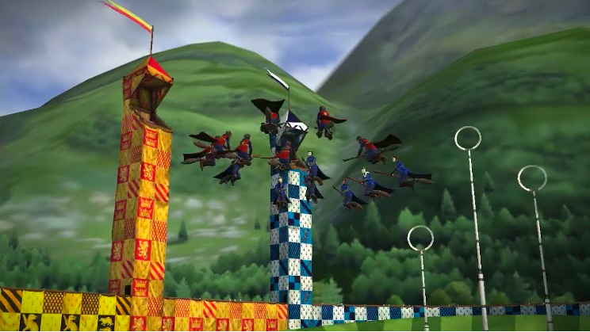
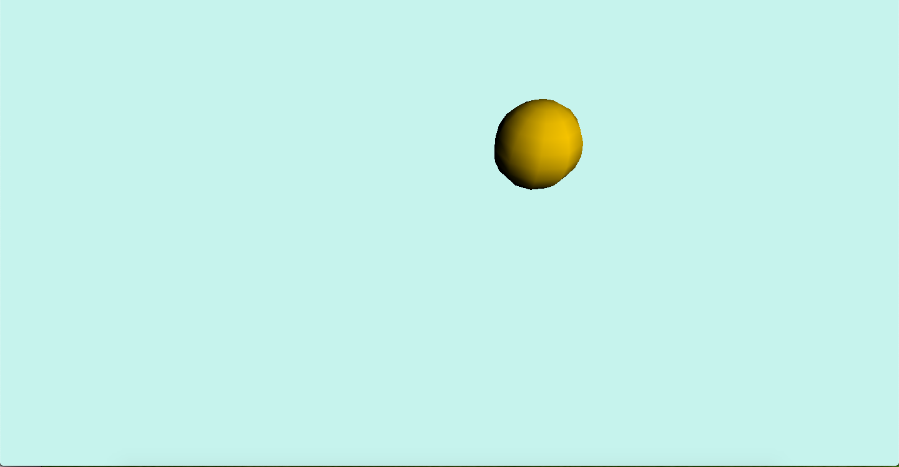
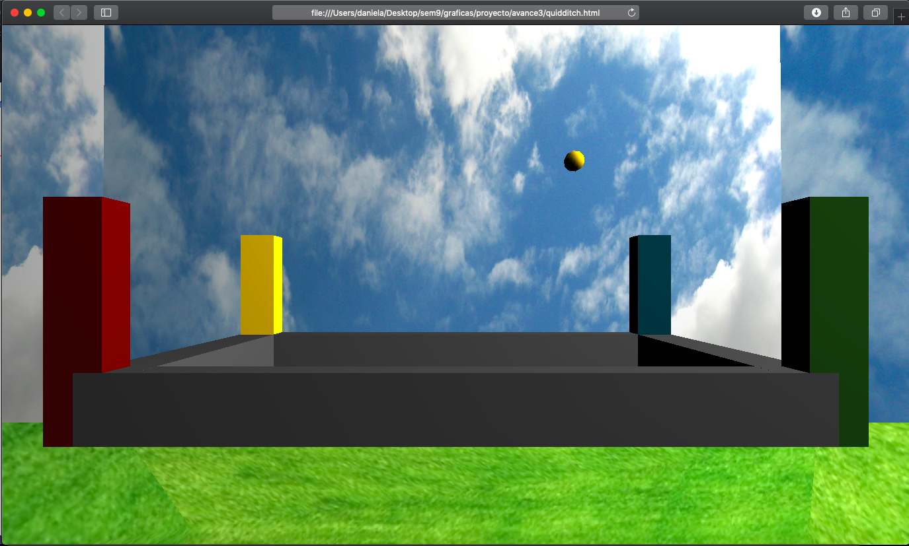

# ProyectoGraficas
Mónica Daniela García Aguilar A01281919

## Campo de Quidditch
Este proyecto consiste de una escena de WebGL mostrando un campo de Quidditch de Harry Potter. Se incluye el campo y la famosa snitch dorada. La snitch cambia de posición cada vez que el usuario da click a la pantalla.

## Tecnologías
Para realizar este proyecto se utilizó WebGL y Three.js 
- https://webglfundamentals.org
- https://threejs.org

## Setup
Para comenzar, solo debes descargar el proyecto y abrir el archivo de quidditch.html en la carpeta de avance 3.

## Avance 1 
Idea: Realizaré el campo de Quidditch de Harry Potter. Dibujaré las torres y el campo. También voy a incluir una snitch, que será un objeto circular. La snitch podrá trasladarse y estará rotando.

Foto de referencia:

 
Posibles referencias: 
-	https://sketchfab.com/3d-models/golden-snitch-sgp29-ddf3f777809845df8c388cd346067d15
-	https://www.toptal.com/javascript/3d-graphics-a-webgl-tutorial
-	https://www.vecteezy.com/free-vector/3d-sphere?license-free=true 
-	https://pngtree.com/freepng/golden-ball-free-map_4437662.html 

## Avance 2
Se incluyó el framework de Three.js, ademas de que realicé la snitch (que es una esfera), y le agregué el movimiento de rotación que tendrá. 

## Avance 3
Se agregó el fondo de nubes y el piso de la escena, también se dibujó el campo de Quidditch, con sus torres. Se agregó la funcionalidad de que al dar click en la pantalla, la snitch cambie de posición de manera aleatoria.

## Vídeo de funcionamiento final
https://youtu.be/4G6inlw8H_o

## Referencias de recursos utilizados
- https://webglfundamentals.org
- https://threejs.org
- https://es.m.wikipedia.org/wiki/Archivo:Appearance_of_sky_for_weather_forecast,_Dhaka,_Bangladesh.JPG
- https://cdn2.cocinadelirante.com/sites/default/files/styles/gallerie/public/mantener-verde-el-pasto-mabelamber.jpg
- https://www.youtube.com/watch?v=6oFvqLfRnsU

